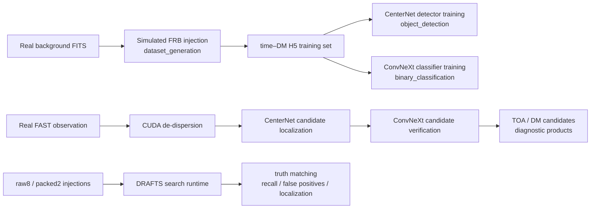

<h1 align="center">DRAFTS</h1>

<div align="center">

**Deep learning-based RAdio Fast Transient Search pipeline**

A deep-learning pipeline for fast radio burst and single-pulse searches

[](https://github.com/SukiYume/DRAFTS)
[](https://github.com/SukiYume/DRAFTS/stargazers)
[](https://arxiv.org/abs/2410.03200)
[](https://www.python.org/)
[](LICENSE)

[Overview](#overview) ·
[Pipeline](#drafts-pipeline) ·
[Quick start](#quick-start) ·
[Training](#model-training) ·
[Search](#searching-real-observation-data) ·
[Injection benchmark](#injection-benchmark) ·
[简体中文](README.md)

</div>

---

## Overview

**DRAFTS** is a Deep learning-based RAdio Fast Transient Search pipeline for
finding fast radio bursts (FRBs) and other single pulses in radio-telescope
observations. It combines accelerated de-dispersion, object detection, and
candidate classification in one trainable and deployable workflow.

The three core stages are:

1. **CUDA-accelerated de-dispersion** to construct the time–DM search
   representation;
2. **CenterNet object detection** to locate candidates and estimate their time
   of arrival (TOA) and dispersion measure (DM);
3. **ConvNeXt binary classification** to reject false positives and reduce
   manual inspection.

This repository contains the current DRAFTS workflows for training-data
generation, CenterNet training, ConvNeXt classifier training, searches of real
FAST observations, and raw8/packed2 injection evaluation.

> Publication:
> [DRAFTS: A Deep Learning-Based Radio Fast Transient Search Pipeline](https://arxiv.org/abs/2410.03200)

### Highlights

- End-to-end coverage from training-data construction to production search;
- GPU-oriented de-dispersion, detection, and candidate classification;
- A two-stage detector/classifier design for localization and verification;
- Search entry points organized around real FAST observations;
- Reproducible raw8/packed2 injection campaigns and a PRESTO baseline;
- Public training data and pretrained models available from Hugging Face, with
  deployment instructions in each workflow README.

## DRAFTS pipeline



| Workflow | Input | Output |
|---|---|---|
| Model training | Real backgrounds, simulated injections, labels | CenterNet and ConvNeXt checkpoints |
| Observation search | FAST FITS, deployed weights, search parameters | Candidates, TOA/DM estimates, diagnostic images |
| Injection evaluation | Background FITS, injection distributions, search weights | Truth matches, recall/false-positive metrics, PRESTO comparison |

## Repository layout

| Path | Role in DRAFTS |
|---|---|
| [`dataset_generation/`](dataset_generation/) | Inject simulated FRBs into real FAST backgrounds and build 512 × 512 time–DM H5 training sets. |
| [`object_detection/`](object_detection/) | Train, evaluate, and run the current CenterNet detector. |
| [`binary_classification/`](binary_classification/) | Train and evaluate ConvNeXt/SPPConvNeXt candidate classifiers. |
| [`search_pipeline/`](search_pipeline/) | Deployable real-observation search, fixed-DM follow-up, PBS submission, and benchmarks. |
| [`injection_benchmark/`](injection_benchmark/) | raw8/packed2 generation, DRAFTS search, truth matching, aggregation, and the PRESTO baseline. |
| [`requirements.txt`](requirements.txt) | Common Python dependencies; install CUDA packages for the target machine separately. |

Each workflow directory has its own README with detailed parameters, data
contracts, output conventions, and operational notes.

## Quick start

```bash
git clone https://github.com/SukiYume/DRAFTS.git
cd DRAFTS
python -m venv .venv
source .venv/bin/activate
python -m pip install -U pip
python -m pip install -r requirements.txt
```

Windows PowerShell:

```powershell
python -m venv .venv
.\.venv\Scripts\Activate.ps1
python -m pip install -U pip
python -m pip install -r requirements.txt
```

Install PyTorch, torchvision, and CuPy with builds compatible with the target
CUDA driver. Production-search notes are available in
[`search_pipeline/requirements.txt`](search_pipeline/requirements.txt).

The following production-search stack was exercised on `pg13` on 2026-07-27.
It is a reproducible baseline, not a minimum-version declaration:

| Python | PyTorch / CUDA build | torchvision | CuPy / CUDA runtime | GPU / driver | Validation |
|---|---|---|---|---|---|
| 3.11.15 | 2.5.1+cu121 / 12.1 | 0.20.1+cu121 | 14.0.1 / 12.9 | NVIDIA L40 / 535.129.03 | PyTorch and CuPy saw all 8 GPUs; CUDA tensor/array operations passed |

The same environment contains NumPy 2.4.4, SciPy 1.16.3, Astropy 7.2.0,
h5py 3.16.0, and Ultralytics 8.4.50. Archive the actual package, GPU, and
driver versions beside every production search.

### Data and pretrained models

- [DRAFTS training data](https://huggingface.co/datasets/TorchLight/DRAFTS)
- [DRAFTS pretrained models](https://huggingface.co/TorchLight/DRAFTS)

The current search runtime uses:

| Task | File | SHA-256 |
|---|---|---|
| CenterNet ConvNeXt-Tiny detector v10 | `object_best_model_centernet_conv_tiny_ema_v10.pth` | `bcad4e710f5f1ccd3c8609d35a8d3fbfc36abd1d85bfefd035e945a573fb0629` |
| ConvNeXt-Small binary classifier | `binary_best_model_conv_small_ema.pth` | `2055745aab76ddc16074516aa7b9aafdfaedf16df37ce8924389573eab27ffd8` |

Download both files directly into `search_pipeline/models/` for observation searches:

```bash
mkdir -p search_pipeline/models
curl -L \
  -o search_pipeline/models/object_best_model_centernet_conv_tiny_ema_v10.pth \
  https://huggingface.co/TorchLight/DRAFTS/resolve/main/object_best_model_centernet_conv_tiny_ema_v10.pth
curl -L \
  -o search_pipeline/models/binary_best_model_conv_small_ema.pth \
  https://huggingface.co/TorchLight/DRAFTS/resolve/main/binary_best_model_conv_small_ema.pth
```

The injection benchmark uses the same two files in the runtime location described
in [`injection_benchmark/README.md`](injection_benchmark/README.md).

## Model training

### Generate CenterNet training data

```bash
cd dataset_generation
RAW_DIR=/path/to/background_fits \
GEN_ROOT=/path/to/generated_training_data \
./run_generation.sh
```

The default campaign generates 50,000 unique injected events, four crops per
event, and sharded outputs that limit concurrent FITS I/O. See
[`dataset_generation/README.md`](dataset_generation/README.md) for the injection model,
sampling distributions, merge step, metadata, and validation tools.

### Train the CenterNet detector

```bash
cd object_detection
DATA_PATH=/path/to/centernet_data \
BATCH_SIZE=24 \
EPOCHS=50 \
./train.sh "0,1,2,3,4,5,6,7" centernet-conv-tiny
```

Copy the selected EMA checkpoint to `search_pipeline/models/` before deployment. See
[`object_detection/README.md`](object_detection/README.md) for data formats,
supported backbones, training arguments, and evaluation.

### Train the ConvNeXt classifier

```bash
cd binary_classification
MODEL_NAME=convnext_small \
EPOCHS=50 \
./train.sh "0,1,2,3"
```

The current search workflow commonly uses `convnext_small`; `convnext_tiny`
remains a lighter deployment option. See
[`binary_classification/README.md`](binary_classification/README.md) for data
layout, model selection, and training arguments.

## Searching real observation data

Search code lives in [`search_pipeline/`](search_pipeline/) and can be deployed as a
self-contained runtime directory.

| Task | Entry point |
|---|---|
| Blind search over unknown DM | `d-center-binary-gate.py` or `t-blind-section.py` |
| Known-DM or candidate-DM follow-up | `d-dm-time-predown.py` |
| PBS batch submission | `s-pbsspt.py` |
| Detector-backend benchmark | `t-object-bench.py` / `t-object-matrix.sh` |
| Binary-classifier comparison | `t-binary-bench.sh` |

Generic blind-search example:

```bash
python search_pipeline/t-blind-section.py \
  --section 0 \
  --data-path /path/to/fast_observation \
  --output-root /path/to/drafts_search_output \
  --gpu-num 1 \
  --beam M01
```

Place detector and classifier checkpoints in `search_pipeline/models/` before running
the search. The full CLI, manifest workflow, fixed-DM mode, output layout, and
troubleshooting guide are documented in
[`search_pipeline/README.md`](search_pipeline/README.md).

## Injection benchmark

[`injection_benchmark/`](injection_benchmark/) measures DRAFTS search
performance on controlled injected signals. It covers signal generation,
raw8/packed2 searches, truth matching, batch aggregation, and a PRESTO
baseline.

| Component | Purpose |
|---|---|
| `generate_injections.py` | Inject simulated FRBs into real backgrounds and write raw8 and optionally packed2 data. |
| `run_campaign.py` | Orchestrate generation, search, analysis, and aggregation. |
| `launch_search.py` | Launch the injection-specific DRAFTS search runtime. |
| `evaluate_results.py` | Match candidates to truth and calculate recall, false positives, and binned metrics. |
| `aggregate_results.py` | Aggregate analysis products across batches. |
| `search_runtime/` | Minimal search runtime and model-weight placeholders. |
| `presto_runtime/` | PRESTO blind-search baseline and threshold sweeps. |

Generic search-only example:

```bash
python injection_benchmark/run_campaign.py \
  --work-root /path/to/injection_runs \
  --run-label example_campaign \
  --batches 20 \
  --count-per-batch 500 \
  --search-only \
  --runtime-dir injection_benchmark/search_runtime \
  --gpu-num 8 \
  --gpu-ids 0,1,2,3,4,5,6,7 \
  --detector-type centernet_conv_tiny \
  --detector-ckpt models/object_best_model_centernet_conv_tiny_ema_v10.pth \
  --classifier-ckpt models/binary_best_model_conv_small_ema.pth \
  --classifier-model-name convnext_small
```

See [`injection_benchmark/README.md`](injection_benchmark/README.md) for
weight placement, raw8/packed2 parallel searches, truth tolerances, and the
PRESTO baseline.

## Run outputs

Each workflow produces a different set of user-facing results:

- model training writes checkpoints, training logs, and validation metrics;
- observation searches write candidate manifests, TOA/DM estimates, and
  diagnostic images;
- injection campaigns write truth matches, recall, false-positive,
  localization, and binned performance summaries.

Use a dedicated output directory for each run and pass data and output
locations through command-line arguments or environment variables. Each
workflow README documents its exact filenames and directory layout.

## Validation

From the repository root:

```bash
python -m compileall -q \
  dataset_generation \
  object_detection \
  binary_classification \
  search_pipeline \
  injection_benchmark
```

Linux shell entry points can be checked with `bash -n path/to/script.sh`.

## DRAFTS and AFTER

DRAFTS performs **search and candidate selection**. After candidate TOA/DM
values have been confirmed, [AFTER](https://github.com/SukiYume/AFTER)
continues the FAST workflow with burst cutting, calibration, label review,
energy measurements, and polarization analysis.

```text
DRAFTS: search and candidate selection
    -> confirmed TOA / DM
AFTER: reduction, calibration and physical measurements
```

## Citation and license

If DRAFTS contributes to your research, cite the
[DRAFTS publication](https://arxiv.org/abs/2410.03200) and record the model
version, checkpoint, data format, and search parameters used in your analysis.

Distributed under the [MIT License](LICENSE).

---

<div align="center">
  <sub>DRAFTS · Searching for fast radio transients with deep learning</sub>
</div>
