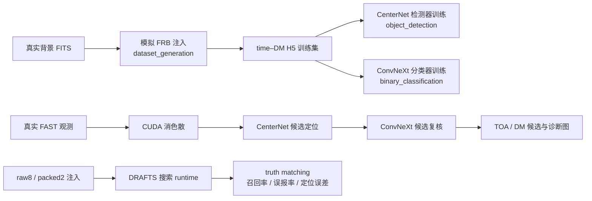

<h1 align="center">DRAFTS</h1>

<div align="center">

**Deep learning-based RAdio Fast Transient Search pipeline**

面向快速射电暴与单脉冲的深度学习搜索流水线

[](https://github.com/SukiYume/DRAFTS)
[](https://github.com/SukiYume/DRAFTS/stargazers)
[](https://arxiv.org/abs/2410.03200)
[](https://www.python.org/)
[](LICENSE)

[项目概览](#项目概览) ·
[流水线](#drafts-流水线) ·
[快速开始](#快速开始) ·
[训练](#模型训练) ·
[真实数据搜索](#真实数据搜索) ·
[注入基准](#注入基准) ·
[English](README.en.md)

</div>

---

## 项目概览

**DRAFTS** 是一套 Deep learning-based RAdio Fast Transient Search
pipeline，用于在射电望远镜观测数据中搜索快速射电暴（FRB）和其他单脉冲暂现源。
它把传统搜索链路中的消色散、候选定位和候选筛选组织成一套可训练、可部署、可评估的
深度学习工作流。

DRAFTS 的核心由三部分组成：

1. **CUDA 加速消色散**：把观测数据转换为适合候选搜索的 time–DM 表示；
2. **目标检测**：使用 CenterNet 从 time–DM 图中定位候选并估计到达时间（TOA）与
   色散量（DM）；
3. **二分类复核**：使用 ConvNeXt 系列分类器过滤伪候选，减少人工检查负担。

当前仓库不仅保存论文版本的核心思想，还维护正在使用的训练数据生成、CenterNet
训练、ConvNeXt 分类器训练、真实 FAST 观测搜索，以及 raw8/packed2 注入评估代码。

> 论文与算法背景：
> [DRAFTS: A Deep Learning-Based Radio Fast Transient Search Pipeline](https://arxiv.org/abs/2410.03200)

### 项目特点

- **端到端搜索**：覆盖训练数据构建、模型训练、真实观测搜索和注入验证；
- **GPU 友好**：消色散、目标检测和分类均可在 CUDA 环境中运行；
- **两阶段候选筛选**：CenterNet 负责定位，ConvNeXt 负责真实性判断；
- **面向真实观测**：当前部署入口围绕 FAST 数据组织，同时保留扩展其他望远镜数据读取
  的接口；
- **独立注入评估**：支持 raw8 与 packed2 数据生成、真值匹配、召回率/误报率统计和
  PRESTO 基线对照；
- **公开资源可用**：训练数据和预训练模型可直接从 Hugging Face 下载，并按各工作流
  README 的说明部署。

## DRAFTS 流水线



从使用角度可以把仓库分为三条主线：

| 主线 | 输入 | 输出 |
|---|---|---|
| 模型训练 | 真实背景、模拟注入、训练标注 | CenterNet 与 ConvNeXt checkpoint |
| 真实搜索 | FAST FITS、部署权重、搜索参数 | 候选清单、TOA/DM、诊断图 |
| 注入评估 | 背景 FITS、注入分布、搜索权重 | truth 匹配结果、召回/误报统计、PRESTO 对照 |

## 仓库结构

| 路径 | 在 DRAFTS 中的职责 |
|---|---|
| [`dataset_generation/`](dataset_generation/) | 向真实 FAST 背景注入模拟 FRB，生成 512 × 512 time–DM 图和 CenterNet H5 训练集。 |
| [`object_detection/`](object_detection/) | 训练、评估和推理当前 CenterNet 检测器。 |
| [`binary_classification/`](binary_classification/) | 训练和评估 ConvNeXt/SPPConvNeXt 候选二分类器。 |
| [`search_pipeline/`](search_pipeline/) | 可部署的真实观测搜索入口、fixed-DM follow-up、PBS 提交和后端 benchmark。 |
| [`injection_benchmark/`](injection_benchmark/) | DRAFTS 注入基准：raw8/packed2 生成、搜索、truth matching、汇总和 PRESTO 基线。 |
| [`requirements.txt`](requirements.txt) | 通用 Python 依赖；CUDA 相关包需按运行机器单独匹配。 |

每个工作流目录都有自己的 README，记录更细的参数、输入输出契约和运行注意事项。

## 快速开始

### 1. 克隆仓库

```bash
: "${DRAFTS_REPOSITORY_URL:?请设置代码仓库地址}"
git clone "$DRAFTS_REPOSITORY_URL" DRAFTS
cd DRAFTS
```

### 2. 创建环境

```bash
python -m venv .venv
source .venv/bin/activate
python -m pip install -U pip
python -m pip install -r requirements.txt
```

Windows PowerShell：

```powershell
python -m venv .venv
.\.venv\Scripts\Activate.ps1
python -m pip install -U pip
python -m pip install -r requirements.txt
```

PyTorch、torchvision 与 CuPy 应根据目标 CUDA 驱动安装。生产搜索环境的补充依赖
和版本提示见 [`search_pipeline/requirements.txt`](search_pipeline/requirements.txt)。
本项目不绑定特定主机或 GPU 型号；正式运行前应在目标环境执行 CUDA smoke test，
并把实际 Python、依赖、GPU 与驱动版本随结果归档。

### 3. 准备数据与模型

训练数据和预训练权重可以来自任意兼容的对象存储或模型仓库。下载默认权重时，
将 `DRAFTS_MODEL_BASE_URL` 设置为能够直接访问下列文件的基础地址。

当前搜索链路使用：

| 任务 | 文件 | SHA-256 |
|---|---|---|
| CenterNet ConvNeXt-Tiny detector v10 | `object_best_model_centernet_conv_tiny_ema_v10.pth` | `bcad4e710f5f1ccd3c8609d35a8d3fbfc36abd1d85bfefd035e945a573fb0629` |
| ConvNeXt-Small binary classifier | `binary_best_model_conv_small_ema.pth` | `2055745aab76ddc16074516aa7b9aafdfaedf16df37ce8924389573eab27ffd8` |

部署真实搜索时可直接下载到 `search_pipeline/models/`：

```bash
mkdir -p search_pipeline/models
: "${DRAFTS_MODEL_BASE_URL:?请设置模型仓库基础地址}"
curl -L \
  -o search_pipeline/models/object_best_model_centernet_conv_tiny_ema_v10.pth \
  "${DRAFTS_MODEL_BASE_URL%/}/object_best_model_centernet_conv_tiny_ema_v10.pth"
curl -L \
  -o search_pipeline/models/binary_best_model_conv_small_ema.pth \
  "${DRAFTS_MODEL_BASE_URL%/}/binary_best_model_conv_small_ema.pth"
```

注入基准使用相同的两个文件，放置位置见
[`injection_benchmark/README.md`](injection_benchmark/README.md)。

## 模型训练

### 训练数据生成

批量入口：

```bash
cd dataset_generation
RAW_DIR=/path/to/background_fits \
GEN_ROOT=/path/to/generated_training_data \
./run_generation.sh
```

默认批次生成 50,000 个唯一注入事件，每个事件构造 4 个 crop，并通过分片控制并发
FITS I/O。主要产物包括训练 H5、标注 JSON、配置、metadata JSONL 和 contact sheet。

完整的注入模型、采样分布、分片合并和检查命令见
[`dataset_generation/README.md`](dataset_generation/README.md)。

### CenterNet 检测器

```bash
cd object_detection
DATA_PATH=/path/to/centernet_data \
BATCH_SIZE=24 \
EPOCHS=50 \
./train.sh "0,1,2,3,4,5,6,7" centernet-conv-tiny
```

当前训练线支持 CenterNet 与 ConvNeXt backbone。部署时把选定的 EMA checkpoint 复制到
`search_pipeline/models/`，并使用搜索入口所要求的文件名。训练参数、数据格式和评估方式见
[`object_detection/README.md`](object_detection/README.md)。

### ConvNeXt 二分类器

```bash
cd binary_classification
MODEL_NAME=convnext_small \
EPOCHS=50 \
./train.sh "0,1,2,3"
```

当前真实搜索通常使用 `convnext_small` 作为候选真实性过滤器，`convnext_tiny` 可作为
更轻量的部署选择。数据组织、模型选择和训练参数见
[`binary_classification/README.md`](binary_classification/README.md)。

## 真实数据搜索

真实搜索代码位于 [`search_pipeline/`](search_pipeline/)，可按该目录边界独立部署到计算节点。

| 任务 | 入口 |
|---|---|
| 未知 DM 盲搜 | `d-center-binary-gate.py` 或 `t-blind-section.py` |
| 已知 DM / 候选 DM follow-up | `d-dm-time-predown.py` |
| PBS 批量提交 | `s-pbsspt.py` |
| 检测后端 benchmark | `t-object-bench.py` / `t-object-matrix.sh` |
| binary 模型对比 | `t-binary-bench.sh` |

通用盲搜示例：

```bash
python search_pipeline/t-blind-section.py \
  --section 0 \
  --data-path /path/to/fast_observation \
  --output-root /path/to/drafts_search_output \
  --gpu-num 1 \
  --beam M01
```

搜索前需要把检测器和分类器权重放入 `search_pipeline/models/`。完整命令、manifest 构建、
输出目录规则、fixed-DM 用法和排错表见 [`search_pipeline/README.md`](search_pipeline/README.md)。

## 注入基准

[`injection_benchmark/`](injection_benchmark/) 用于检验 DRAFTS 在受控注入信号上的
搜索表现，覆盖信号生成、raw8/packed2 搜索、真值匹配、批次汇总和 PRESTO 基线对照。

主要入口：

| 文件 | 作用 |
|---|---|
| `generate_injections.py` | 向真实背景注入模拟 FRB，生成 raw8，并可同步生成 packed2。 |
| `run_campaign.py` | 调度生成、搜索、分析和聚合，支持 generate-only 与 search-only。 |
| `launch_search.py` | 启动注入基准专用 DRAFTS 搜索 runtime。 |
| `evaluate_results.py` | 匹配 truth 与候选，计算召回、误报和参数分箱结果。 |
| `aggregate_results.py` | 汇总多个 batch 的分析结果。 |
| `search_runtime/` | 注入基准使用的精简搜索代码与权重占位说明。 |
| `presto_runtime/` | PRESTO blind-search 基线与阈值扫描代码。 |

通用 search-only 示例：

```bash
python injection_benchmark/run_campaign.py \
  --work-root /path/to/injection_runs \
  --run-label example_campaign \
  --batches 20 \
  --count-per-batch 500 \
  --search-only \
  --runtime-dir injection_benchmark/search_runtime \
  --gpu-num 8 \
  --gpu-ids 0,1,2,3,4,5,6,7 \
  --detector-type centernet_conv_tiny \
  --detector-ckpt models/object_best_model_centernet_conv_tiny_ema_v10.pth \
  --classifier-ckpt models/binary_best_model_conv_small_ema.pth \
  --classifier-model-name convnext_small
```

权重放置、raw8/packed2 并行搜索、truth matching 容差和 PRESTO 对照见
[`injection_benchmark/README.md`](injection_benchmark/README.md)。

## 运行结果

不同工作流会产生不同类型的结果：

- 模型训练输出 checkpoint、训练日志和验证指标；
- 真实观测搜索输出候选清单、TOA/DM 估计和诊断图；
- 注入基准输出 truth matching、召回率、误报率、定位误差和分箱统计。

建议每次运行使用独立的输出目录，并通过命令行参数或环境变量传入数据和结果位置。
具体文件名与目录结构见各工作流 README。

## 快速验证

从仓库根目录运行：

```bash
python -m compileall -q \
  dataset_generation \
  object_detection \
  binary_classification \
  search_pipeline \
  injection_benchmark
```

Shell 脚本可在 Linux 环境中使用 `bash -n path/to/script.sh` 做静态语法检查。

## DRAFTS 与 AFTER

DRAFTS 负责在观测数据中**寻找和筛选暂现源候选**。当候选 TOA/DM 已经确认后，可以把
后续 FAST burst 裁切、定标、标注复核、能量与偏振分析交给 AFTER。

```text
DRAFTS: search and candidate selection
    -> confirmed TOA / DM
AFTER: reduction, calibration and physical measurements
```

## 引用与许可

如果本仓库对你的研究有帮助，请引用
[DRAFTS 论文](https://arxiv.org/abs/2410.03200)，并在方法部分注明使用的模型版本、
checkpoint、搜索参数和数据格式。

本项目采用 [MIT License](LICENSE)。

---

<div align="center">
  <sub>DRAFTS · Searching for fast radio transients with deep learning</sub>
</div>
